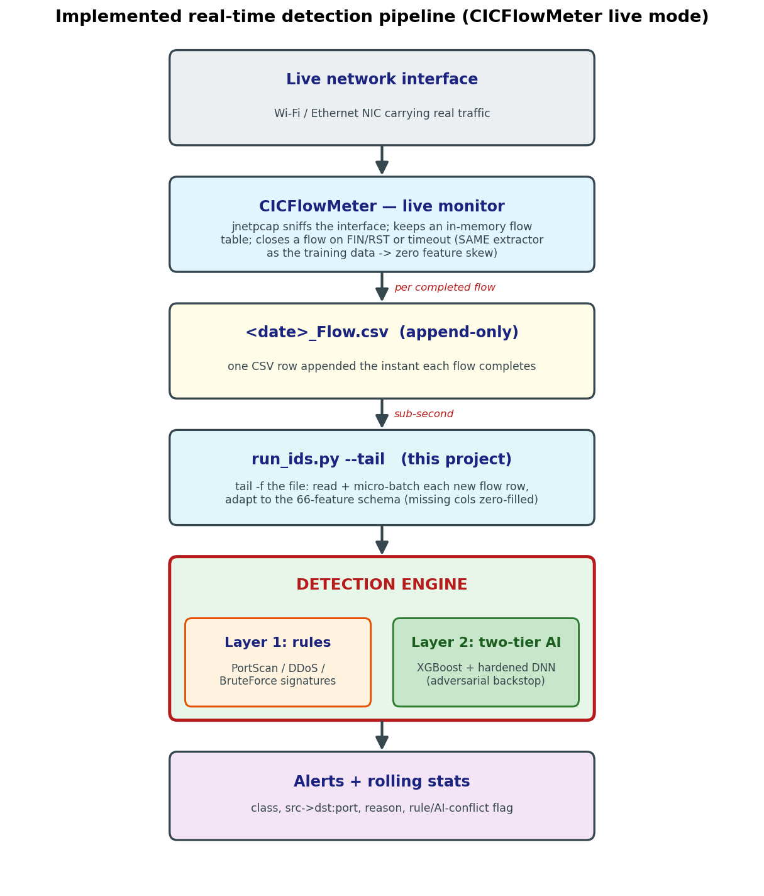
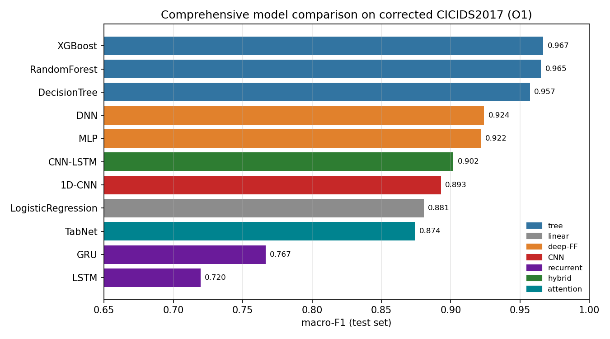
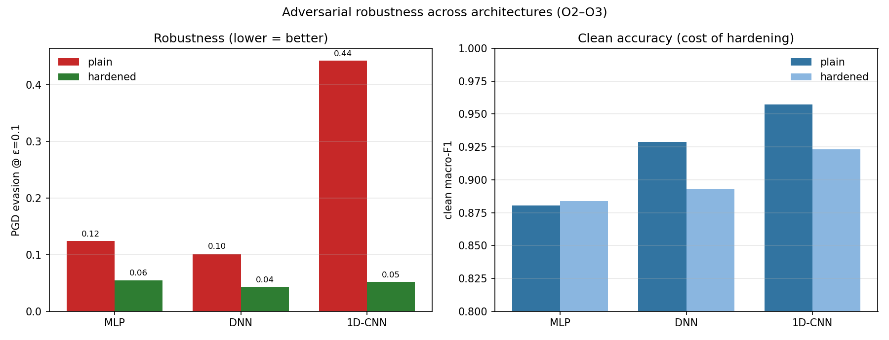
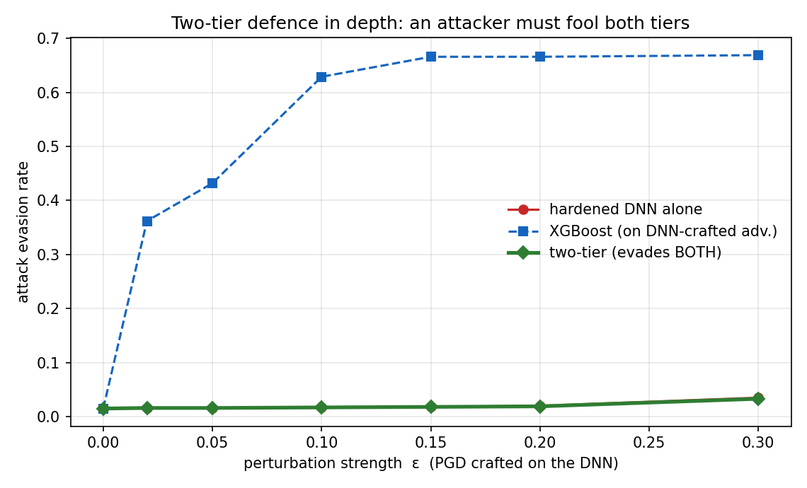
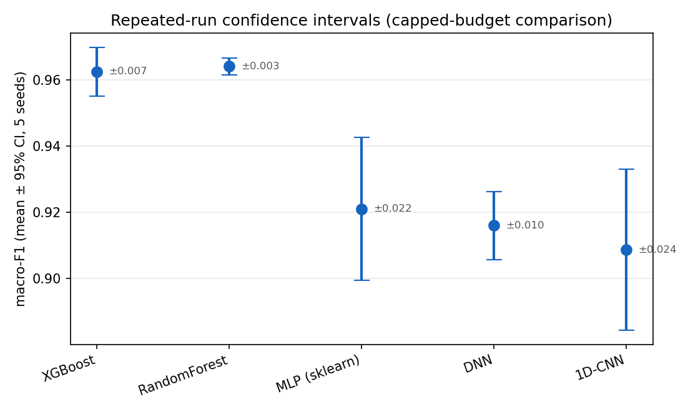

# Adversarial-Robust Network Intrusion Detection System

A deployable, **two-layer deep-learning NIDS** that stays reliable under adversarial
attack. It pairs a fast, explainable **signature rule layer** with a **two-tier AI
core** (XGBoost + an adversarially-hardened DNN), runs in **real time** off a live
CICFlowMeter feed, and ships with a **fully-automated test suite**. Built and evaluated
on the *corrected* CICIDS2017 dataset with imbalance-aware metrics throughout.

> Research theme: *to what extent do deep-learning NIDS stay reliable under adversarial
> perturbation, class imbalance and rare attack classes — and can adversarial training
> improve robustness without hurting clean performance, across architectures?*

---

## Highlights

- **Broad, fair model comparison** — 11 architectures (trees, linear, MLP/DNN, 1D-CNN, LSTM/GRU, CNN-LSTM, TabNet) on the same leakage-free split with **imbalance-aware metrics** (macro-F1, balanced accuracy, MCC, per-class FPR).
- **Adversarial robustness study** — true-gradient **FGSM/PGD** attacks + **adversarial training**; quantifies the robustness–accuracy trade-off across architectures.
- **Two-tier defence in depth** — a non-differentiable tree + a hardened DNN, so an attacker must fool **both** at once. Surfaces a non-obvious result: gradient perturbations **transfer** from the DNN to XGBoost.
- **Real-time pipeline** — CICFlowMeter live monitor → `tail -f` streaming consumer → detection, scoring each flow the instant it completes (**~159k flows/s** batch throughput).
- **Engineering rigour** — a 5-layer automated test harness (unit → integration → performance → robustness → attack-simulation), **43/43 checks**, with a graded HTML report.
- **Scientific rigour** — repeated-run 95% confidence intervals, a stronger **adaptive** ensemble attack, a successful-vs-attempted rare-class breakdown, a latency-distribution deployment study, and a full [methodology & threat-model spec](METHODOLOGY.md) with honestly-stated limitations.

## System architecture



A flow is flagged as an attack if **either** layer fires (defence in depth); the rule
layer gives an instant, explainable verdict on known attacks, and the two-tier AI core
generalises to novel, obfuscated and adversarial traffic.

## Results

### 1 — Model comparison (test macro-F1, ranked)

| Model | macro-F1 | balanced-acc | macro-FPR |
|---|---|---|---|
| **XGBoost** | **0.967** | 0.986 | **0.0005** |
| Random Forest | 0.965 | 0.975 | 0.0047 |
| Decision Tree | 0.957 | 0.974 | 0.0049 |
| **DNN** (best differentiable) | 0.924 | 0.969 | 0.0050 |
| MLP | 0.922 | 0.973 | 0.0050 |
| CNN-LSTM | 0.902 | 0.968 | 0.0054 |
| 1D-CNN | 0.893 | 0.981 | 0.0013 |
| Logistic Regression | 0.881 | 0.979 | 0.0015 |
| TabNet | 0.874 | 0.982 | 0.0020 |
| GRU | 0.767 | 0.942 | 0.0108 |
| LSTM | 0.720 | 0.941 | 0.0118 |



**Gradient-boosted trees win on tabular flow data**; the DNN is the best differentiable
model; **recurrent models are worst** — flow-level features carry no temporal ordering,
so sequence models have nothing to exploit (a clean negative control).

### 2 — Adversarial robustness



The **1D-CNN is clean-strong but catastrophically fragile** (PGD evasion **0.44**);
**adversarial training** drops evasion to **~0.05** for every architecture at a small
clean-accuracy cost. High clean accuracy is *not* a proxy for robustness.

### 3 — Two-tier defence in depth



Perturbations crafted on the DNN **transfer to XGBoost, evading it in up to 67%** of
cases — a non-differentiable tree is *not* inherently safe. The hardened DNN resists the
same attack (~2%), and because the two-tier system requires fooling **both** tiers, it
keeps DNN-level robustness while retaining macro-F1 ≈ 0.96 and a ~0.5% false-alarm rate.

### 4 — Rigour: repeated runs, adaptive attack, honest limitations

**Repeated-run confidence intervals** (5 seeds) show the tree models are stable and the
neural nets are not — and the tree-vs-neural intervals do not overlap, so the ranking is
statistically supported, not noise:



**Adaptive attack.** A stronger white-box attack optimised against the ensemble (50-step
PGD, 5 restarts, concentrated on the hardened DNN — the binding constraint) leaves
two-tier evasion essentially unchanged from the transfer attack (0.017 at ε = 0.1), so the
robustness is not an artefact of a weak attacker. This is honestly qualified: the
perturbations are unconstrained in feature space (a conservative upper bound, not
necessarily feasible traffic), and query-based / realizable attacks are named as further
work.

**Successful vs attempted attacks.** Reporting rare classes split by the *attempted* flag
exposes a blind spot the headline recall hides — attempted DoS is detected only ~9% of the
time versus ~100% for successful attacks.

See **[METHODOLOGY.md](METHODOLOGY.md)** for the full protocol: experiment provenance and
reconciliation, the adversarial threat model, the leakage-aware split definition, the
tuning procedure, and the deployment measurement (which separates model inference from the
capture-to-alert pipeline).

## Repository structure

```
src/                       core library
  data.py                  corrected-CICIDS2017 loading, 8-class map, leakage-free split
  models.py / models_extra.py  11 model families + shared trainers
  security.py              FGSM/PGD attacks, adversarial training, robustness curves
  metrics.py               imbalance-aware, per-class evaluation
  rule_layer.py            Layer 1 — signature rules (PortScan/DDoS/BruteForce)
  two_tier.py              XGBoost + hardened-DNN fusion
  detection_engine.py      Layer 1 + Layer 2 fused engine
  realtime.py              CICFlowMeter adapter + tail -f streaming consumer
run_ids.py                 CLI: --tail (live) / --watch / --csv / --replay
run_system_tests.py        automated test harness → graded report
tests/                     pytest suite (unit + integration)
experiments/               reproducible pipeline: preprocess, baselines, comparison, robustness, ...
results/figures|tables/    generated figures and metric tables
notebooks/                 technical walkthrough (HTML + ipynb)
METHODOLOGY.md             protocol, threat model, provenance, CIs, deployment measurement
```

## Reproducing

The dataset and trained model binaries are **not** included (dataset licence + file
size). To reproduce end-to-end:

```bash
pip install -r requirements.txt
# 1. download the CORRECTED CICIDS2017 (Engelen et al., WTMC 2021) into data/raw/
python experiments/preprocess.py          # leakage-free split + scaling -> data/processed/
python experiments/model_comparison.py    # trains + ranks the 11 models
python experiments/two_tier_eval.py        # two-tier clean + robustness
python run_system_tests.py                 # full automated test suite -> results/test_reports/
```

Live detection (needs CICFlowMeter + Npcap): start CICFlowMeter's real-time monitor on
your interface, then:

```bash
python run_ids.py --tail "<CICFlowMeter_output>/<date>_Flow.csv"
```

## Tech stack

Python · scikit-learn · XGBoost · PyTorch · CICFlowMeter · pandas/NumPy · pytest ·
Matplotlib.

## Notes

- Built on the **corrected** CICIDS2017 (Engelen, Rimmer & Joosen, WTMC 2021), which
  fixes flow-construction and labelling defects in the original release.
- Adversarial perturbations here are unconstrained in feature space — a **conservative
  upper bound** on a realistic attacker who must keep traffic protocol-valid.
- Research / educational project. No dataset or captured traffic is redistributed here.

## License

MIT — see [LICENSE](LICENSE).
